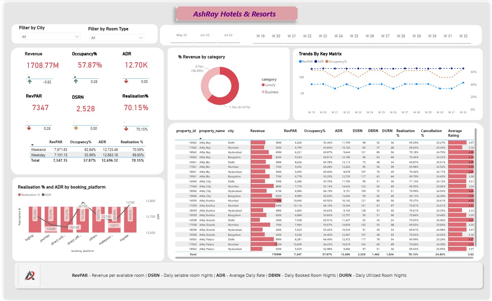

# 🏨 ASHRAY HOTELS & RESORTS – POWER BI DASHBOARD

## 📊 OVERVIEW

- This Power BI dashboard provides a comprehensive performance analysis of **AshRay Hotels & Resorts**.
- It focuses on key hospitality metrics such as **Revenue, Occupancy, ADR, RevPAR, and Realisation %**.
- The dashboard helps hotel management and stakeholders monitor **property-wise, city-wise, and platform-wise performance** and make data-driven decisions.

---

## 🚀 OBJECTIVES

- Track overall **revenue and occupancy performance** across hotels.
- Analyze **RevPAR, ADR, and Realisation %** trends over time.
- Compare **Luxury vs Business** category revenue contribution.
- Evaluate **property-level performance** across different cities.
- Understand booking behavior across **different booking platforms**.
- Monitor **weekday vs weekend** performance.

---

## 📸 DASHBOARD PREVIEW

### 🏨 Hotel Performance Analysis Dashboard

---

## 📌 KEY KPIs

- **Total Revenue:** 1708.77M  
- **Occupancy Rate:** 57.87%  
- **ADR (Average Daily Rate):** 12.70K  
- **RevPAR:** 7,347  
- **DSRN:** 2,528  
- **Realisation %:** 70.15%  

---

## 📊 KEY INSIGHTS

### 1. **Revenue by Category**
- **Luxury Hotels:** ~61.6% of total revenue  
- **Business Hotels:** ~38.4% of total revenue  

### 2. **Trend Analysis**
- RevPAR, ADR, and Occupancy % trends are tracked weekly.
- Stable ADR with fluctuating occupancy directly impacts RevPAR.

### 3. **Property-Level Performance**
- Detailed table shows **Revenue, RevPAR, Occupancy, ADR, DSRN, DBRN, DURN**, and **Ratings** by property.
- Helps identify **top-performing and underperforming hotels**.

### 4. **Booking Platform Analysis**
- Comparison of **ADR and Realisation %** across platforms such as:
  - LogTrip
  - Journey
  - Direct Online
  - Direct Offline
  - Tripster
- Enables optimization of channel strategy.

### 5. **Weekday vs Weekend Performance**
- Weekends show higher **ADR and Occupancy** compared to weekdays.
- Useful for pricing and demand forecasting strategies.

---

## 🧰 TOOLS & TECHNOLOGIES USED

- Microsoft Power BI
- DAX for calculated measures
- Data modeling and interactive slicers

---

## 📖 METRIC DEFINITIONS

- **RevPAR:** Revenue per Available Room  
- **ADR:** Average Daily Rate  
- **DSRN:** Daily Sellable Room Nights  
- **DBRN:** Daily Booked Room Nights  
- **DURN:** Daily Utilized Room Nights  

---

## 📎 HOW TO VIEW

1. Clone or download the repository  
2. Open the `.pbix` file using **Power BI Desktop**  
3. Use filters to explore data by **city, room type, and time period**

---

## 🎯 BUSINESS VALUE

- Enables real-time monitoring of hotel KPIs  
- Supports pricing, occupancy, and revenue optimization  
- Improves visibility into channel and property performance
